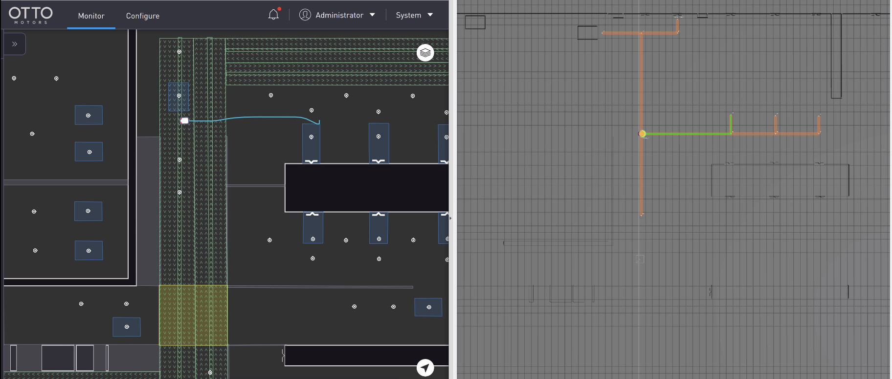

# fleet_adapter_clearpath
An open source fleet adapter for integrating Otto robots with Open-RMF.
This adapter communicates with the robots over ROS 2 topics and actions.



## Requirements
* ROS 2 Foxy
* Clearpath API (v1.3.3)

## Setup
Follow the instructions [here](https://github.com/open-rmf/rmf#building-from-sources) to create an RMF workspace.
Install all necessary dependencies but do not run the `colcon build..` step yet.
Next clone in this repository into the same workspace
```bash
cd ~/rmf_ws/src
git clone https://github.com/open-rmf/fleet_adapter_clearpath.git
cd ~/rmf_ws
rosdep install --from-paths src --ignore-src --rosdistro foxy -yr
source /opt/ros/foxy/setup.bash
source /opt/clearpath/ros2-api-1.3.3-0/setup.bash # or wherever the clearpath api is located
colcon build --cmake-args -DCMAKE_BUILD_TYPE=Release --packages-up-to fleet_adapter_clearpath

```

## To run only the fleet adapter
```bash
source ~/rmf_ws/install/setup.bash
ros2 run fleet_adapter_clearpath fleet_adapter --ros-args -p nav_graph_file:=NAV_PATH -p config_file:=CONFIG_PATH
```

[Sample config file](config.yaml)
